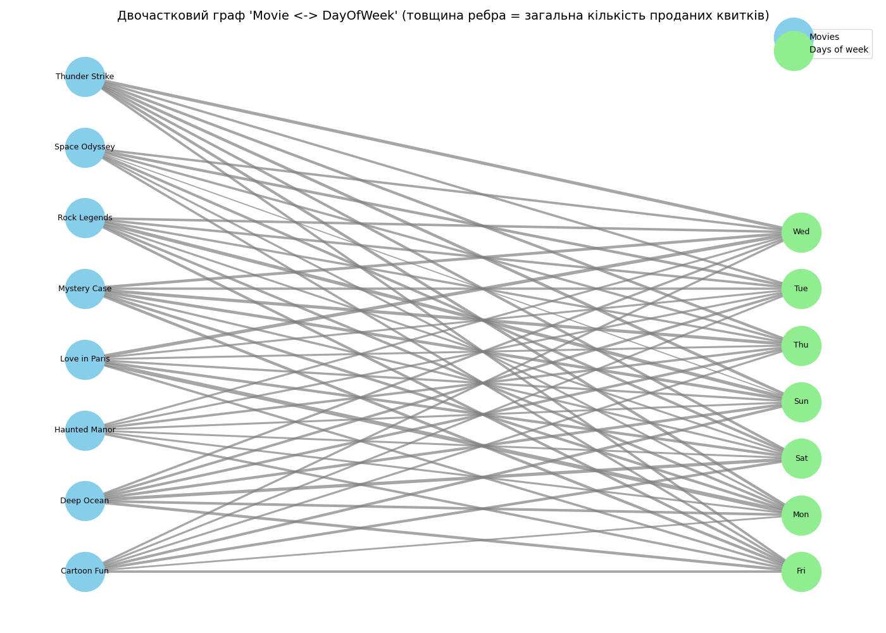

# Мережевий аналіз набору даних кінотеатру (СР №12)

## 1. Набір даних та побудова графа

Для дослідження використано набір даних `cinema_dataset_1000.csv`. Були визначені два типи вершин:

- **Фільми** (`movie_title`)
- **Дні тижня** (`day_of_week`)

На їх основі побудовано неорієнтований ваговий двочастковий граф, де:

- вершини першої частки відповідають фільмам,
- вершини другої частки відповідають дням тижня,
- ребро між ними існує, якщо фільм демонструвався у відповідний день,
- вага ребра — загальна кількість проданих квитків на цей фільм у цей день.

У підсумку граф містить **15 вершин** та **56 ребер**.

## 2. Аналіз за допомогою алгоритмів обходу (DFS / BFS)

### 2.1. Компоненти зв’язності (DFS)

У графі знайдено 1 компонент(и) зв'язності.

Усі фільми та дні тижня утворюють єдину взаємопов’язану мережу, що вказує на повну зв’язність графа.

### 2.2. Найкоротший шлях між фільмами (BFS)

Найкоротший шлях між фільмами 'Cartoon Fun' та 'Thunder Strike' має довжину 2 крок(ів).

Це означає, що вони пов'язані через спільні дні показу або через інші фільми й дні у двочастковій мережі.

## 3. Візуалізація графа

Нижче наведено зображення двочасткового графа, де товщина ребер відповідає кількості проданих квитків:

## 4. Зведена таблиця (аналог OLAP-куба)

У таблиці нижче наведено сумарну кількість проданих квитків для кожного фільму у розрізі днів тижня. Рядки — фільми, стовпці — дні тижня:

| movie_title    |   Fri |   Mon |   Sat |   Sun |   Thu |   Tue |   Wed |
|:---------------|------:|------:|------:|------:|------:|------:|------:|
| Cartoon Fun    |  1364 |   880 |  1507 |  1517 |  1067 |  1034 |  1122 |
| Deep Ocean     |  1586 |  1464 |  1895 |  1566 |  1477 |  1411 |  1212 |
| Haunted Manor  |  1294 |  1013 |  1002 |  1027 |  1300 |  1077 |  1056 |
| Love in Paris  |  1244 |  2394 |  1539 |  1168 |  1026 |  1039 |  1956 |
| Mystery Case   |  1593 |  1525 |  1156 |  1695 |  1825 |  1229 |  1599 |
| Rock Legends   |  1498 |  1438 |  1035 |  2023 |  1213 |  1332 |  1382 |
| Space Odyssey  |  1246 |  1059 |  1484 |   501 |  1248 |  1558 |  1272 |
| Thunder Strike |  1325 |  1601 |  1460 |  1665 |  1516 |  1236 |  1844 |

## 5. Висновки

- Створена мережа дає змогу аналізувати взаємозв’язок між фільмами та днями тижня за кількістю продажів квитків.
- Алгоритми DFS і BFS дозволяють визначати структуру графа та досліджувати зв’язність між різними елементами розкладу.
- Вагові ребра дозволяють виявити найбільш прибуткові дні для кожного фільму та визначити закономірності продажів.
- Зведена таблиця може бути використана як інструмент для подальшого аналітичного опрацювання, зокрема оптимізації розкладу та цінової політики.
