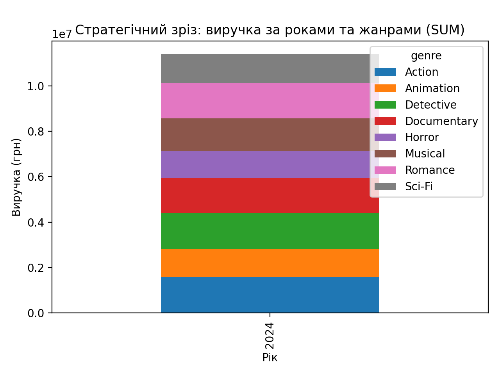
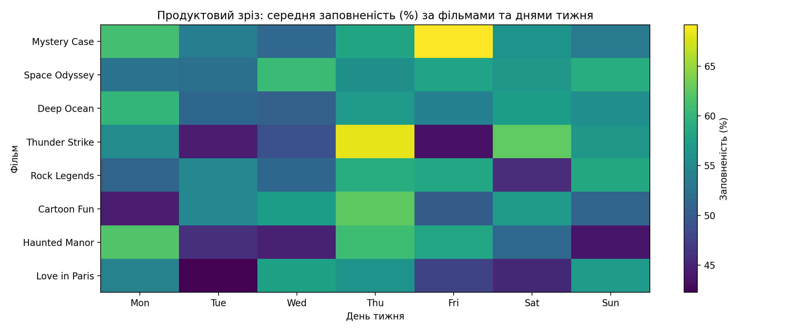

# Практична робота №6: OLAP-зрізи та візуалізація для даних кінотеатру

## 1. Вихідні дані

Для аналізу використано набір даних кінотеатру у форматі CSV. Дані містять інформацію про дату сеансу, фільм, жанр, день тижня, ціну квитка, кількість проданих квитків та заповненість залу.

Додатково обчислено показник **виручки**:

- `revenue = ticket_price × tickets_sold`

## 2. Стратегічний зріз

**Мета зрізу:** оцінити структуру виручки кінотеатру в розрізі **років** та **жанрів**.

- Виміри: `year`, `genre`
- Міра: `SUM(revenue)`

### Таблиця 2.1. Виручка за роками та жанрами (pivot)

|   year |       Action |    Animation |    Detective |   Documentary |       Horror |      Musical |      Romance |       Sci-Fi |
|-------:|-------------:|-------------:|-------------:|--------------:|-------------:|-------------:|-------------:|-------------:|
|   2024 | 1,586,140.55 | 1,247,123.45 | 1,560,472.58 |  1,545,542.83 | 1,194,578.25 | 1,429,650.90 | 1,545,431.36 | 1,292,658.66 |

### Рисунок 1. Стратегічний зріз: виручка за роками та жанрами

Пояснення: графік показує, як змінюється сумарна виручка у різні роки, а також який внесок у загальну виручку робить кожен жанр.

## 3. Операційний зріз (KPI)

**Мета зрізу:** порівняти ефективність фільмів за ключовими показниками.

- Виміри: `movie_title`, `genre`
- Міри: `SUM(revenue)`, `SUM(tickets_sold)`, `AVG(occupancy)`, `AVG(ticket_price)`

### Таблиця 3.1. KPI-показники по фільмах (TOP-15 за виручкою)

|    | movie_title    | genre       |   total_revenue |   total_tickets_sold |   avg_occupancy |   avg_ticket_price |
|---:|:---------------|:------------|----------------:|---------------------:|----------------:|-------------------:|
|  7 | Thunder Strike | Action      |    1,586,140.55 |                10647 |           54.50 |             155.01 |
|  4 | Mystery Case   | Detective   |    1,560,472.58 |                10622 |           57.49 |             151.71 |
|  1 | Deep Ocean     | Documentary |    1,545,542.83 |                10611 |           55.15 |             151.46 |
|  3 | Love in Paris  | Romance     |    1,545,431.36 |                10366 |           52.18 |             153.03 |
|  5 | Rock Legends   | Musical     |    1,429,650.90 |                 9921 |           54.53 |             149.49 |
|  6 | Space Odyssey  | Sci-Fi      |    1,292,658.66 |                 8368 |           55.95 |             157.43 |
|  0 | Cartoon Fun    | Animation   |    1,247,123.45 |                 8491 |           53.96 |             151.94 |
|  2 | Haunted Manor  | Horror      |    1,194,578.25 |                 7769 |           52.84 |             159.01 |

### Рисунок 2. KPI-зріз: заповненість vs виручка (розмір точки = продані квитки)

Пояснення: точкова діаграма демонструє взаємозв’язок між середньою заповненістю залу та виручкою. Розмір точки відображає сумарну кількість проданих квитків. Це дозволяє швидко знаходити фільми з високою/низькою ефективністю.

## 4. Продуктовий зріз

**Мета зрізу:** дослідити середню заповненість залу у розрізі **фільмів** та **днів тижня**.

- Рядки: `movie_title`
- Стовпці: `day_of_week`
- Значення: `AVG(occupancy)`

### Таблиця 4.1. Матриця заповненості (AVG occupancy)

| movie_title    |   Mon |   Tue |   Wed |   Thu |   Fri |   Sat |   Sun |
|:---------------|------:|------:|------:|------:|------:|------:|------:|
| Mystery Case   | 61.24 | 53.67 | 51.45 | 58.10 | 69.16 | 55.97 | 53.07 |
| Space Odyssey  | 52.60 | 52.13 | 60.47 | 55.81 | 57.90 | 56.52 | 59.12 |
| Deep Ocean     | 60.09 | 51.38 | 50.35 | 56.81 | 53.90 | 57.21 | 55.45 |
| Thunder Strike | 55.22 | 44.43 | 49.02 | 68.22 | 43.53 | 62.61 | 56.53 |
| Rock Legends   | 50.95 | 54.80 | 51.34 | 59.10 | 58.43 | 45.64 | 58.65 |
| Cartoon Fun    | 44.38 | 54.81 | 57.19 | 62.44 | 50.19 | 56.76 | 50.79 |
| Haunted Manor  | 61.90 | 45.87 | 44.70 | 60.83 | 58.23 | 51.46 | 43.89 |
| Love in Paris  | 54.15 | 42.26 | 57.67 | 56.21 | 47.62 | 45.39 | 57.05 |

### Рисунок 3. Теплова карта заповненості (фільм × день тижня)

Пояснення: теплова карта відображає середню заповненість для кожного фільму залежно від дня тижня. Це зручно для порівняння патернів відвідуваності та подальшої оптимізації розкладу.

## 5. Підсумок

У межах практичної роботи побудовано три базові OLAP-зрізи (стратегічний, операційний та продуктовий), а також виконано їх візуалізацію. Отримані таблиці та графіки можуть використовуватися як основа для подальшої аналітики та управлінських рішень у рамках проєкту «Кінотеатр».
